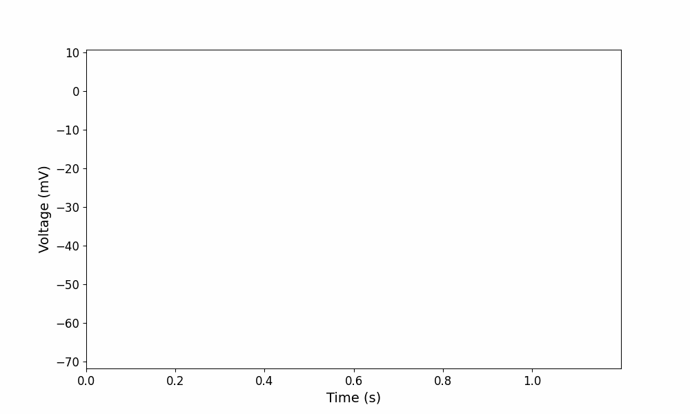

# 🎬 ABF Spike Animator 🎧  

**ABF Spike Animator** transforms electrophysiological data into an interactive audiovisual experience. It converts action potential signals into **sound and animation**, making neuronal activity more intuitive to visualize.  

---

## ✨ Features  
✅ **Processes `.abf` files** to extract neuronal signals.  
✅ **Detects action potentials** using advanced peak detection.  
✅ **Generates audio** that represents neuronal firing activity.  
✅ **Creates animated videos and GIFs** for voltage visualization.  
✅ **Customizable settings** for speed, volume, tone frequency, and playback effects.  

## 📦 Installation  
Before running the script, install the required dependencies:  
pip install pyabf numpy scipy matplotlib moviepy

## 🎥 Example Output  
Here’s an example of an **action potential visualization** generated by the tool:  

[🎬 Watch the Video](exp_001_video.mp4)

## 📌 Notes  
- Supports **multiple types of electrophysiological data**.  
- Adjustable **parameters for precision analysis and visualization**.  
- Enables **real-time playback adjustments for better interpretation**.
 ## 👨‍🔬 Credits  
Developed by **Felipe Guiffa Gomez felipe.guiffa@postgrado.uv.cl **, Chile.
